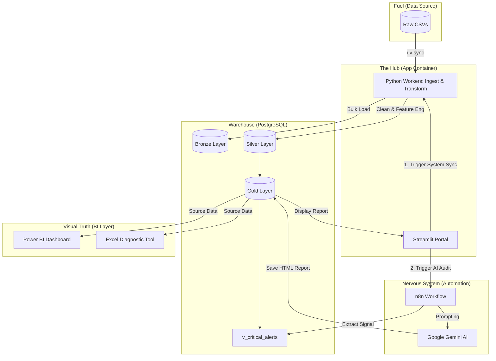

# 🛡️ COVID-19 AI Early Warning System

Welcome to the central documentation for the **COVID-19 Surveillance & AI Early Warning Portal**. This system integrates high-performance Data Engineering (Medallion Architecture), Generative AI (Google Gemini), and Business Intelligence (Power BI/Excel) into a unified executive command center.

---

## 🏗️ System Architecture & Data Flow

The following diagram illustrates the modern, consolidated setup where the `app` service manages both the **Executive UI** and the **ETL Orchestration**.



---

## 📖 Knowledge Base (In-Depth Guides)

Navigate the project's specialized documentation for technical and strategic details:

### **1. Strategic Foundation**
*   **[Business Context](./business_context.md)**: Industry background, stakeholder personas, and the specific **Risk Formulas** (Weighted Risk Scores) used to flag outbreaks.
*   **[AI Intelligence Setup](./ai_intelligence_setup.md)**: A complete map of SQL Data Signals combined with optimized System Prompts for Gemini.

### **2. Technical Infrastructure**
*   **[Infrastructure & Deployment](./infrastructure.md)**: Details on the Dockerized setup, `.env` credential management, and "self-healing" volumes.
*   **[n8n Automation Logic](./n8n_workflow.md)**: Breakdown of the surveillance blueprints and the human-in-the-loop feedback handler.

### **3. Analysis & Insights**
*   **[Power BI Dashboard Plan](./powerbi_analysis_plan.md)**: DAX measures and visual goals for national situational awareness.
*   **[Excel Diagnostic Roadmap](./excel_analysis_plan.md)**: Formula-driven templates for surgical audits and specific stakeholder questions.

---

## 🕹️ The Control Plane: Quick Actions

| Feature | Action | Stakeholder Value |
| :--- | :--- | :--- |
| **🔄 Full System Sync** | Wipes staging, re-ingests CSVs, and runs Silver/Gold ETL. | Ensures the warehouse reflects the latest raw data drops. |
| **🪄 Run AI Risk Audit** | Triggers n8n to query the Gold Layer and generate a Gemini report. | Provides qualitative, human-readable strategy on top of the numbers. |
| **🚩 Active Alert Table** | Displays the top 10 states exceeding risk thresholds. | Immediate identification of national "Hot Zones." |

---

## 🚀 One-Click Deployment
Ready to launch? Ensure your `.env` is configured and run:
```bash
docker-compose up -d
```
Visit the portal at `http://localhost:8501`.
